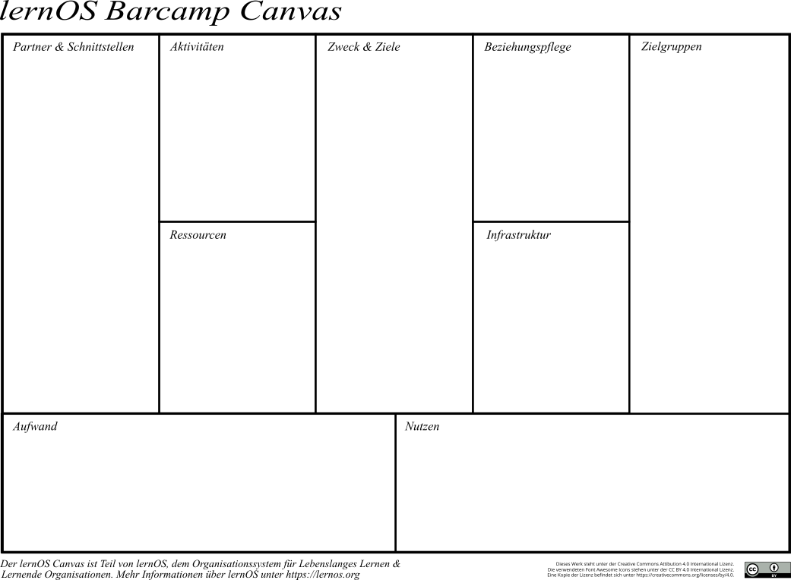

# Vorwort

...

\@simondueckert

# Danksagung

....

# Grundlagen

## Barcamp-Geschichte (SD)

...

## Barcamp-DNA (KHP)

...

## Barcamp-Ablauf (KHP)

... inkl. Varianten ...

## Barcamp-Infrastruktur (SD)

Webseite, Anmeldeprozess, Community Plattform

## Barcamp-Rollen (SD)

...

## Barcamp-Eventmanagement (SD)

Grundhaltung über Schein/Kultur ...

# Barcamp Lernpfad

## Organisatoren Checkliste
... für das Kick-off und den Regeltermin ...

## Kata: Get started (SD)

Mache dich mit den Grundlagen des Podcastings über das Grundlagen-Kapitel sowie die weiterführenden Literatur- und Weblinks vertraut.

## Kata: Barcamp Hospitation - Live & Remote (KHP)

## Kata: Nutze den Barcamp Canvas (SD)

... Beschreibungstext des Canvas ...

## Kata: Barcamp Kick-off (KHP)

Rechtliches, Foto, Film, Veranstalter, Versicherung

## Kata: Key Facts mit dem Barcamp Steckbrief (KHP)

1-Pager mit Ziel, Zweck, Titel, Warum etc. ...

## Kata: Der Community Fahrplan (SD)

Experten, Influencer, Hochschulen ... die wichtig für das Barcamp sind ...

## Kata: Kommunikation, Kommunikation, Kommunikation (KHP, SD)

Marketing, PR. Wann willst du was an welche Zielgruppe kommunizieren

## Kata: Wie nutzen wir die Fläche? (KHP)

Plenum, Breakout-Räume, Ausstattung, Infrastruktur

## Kata: Die Webseite für das Barcamp (SD)

Webseite + Anmeldeprozess

## Kata: Barcamp Community Habitat (SD)

## Kata: Klappe - Das Barcamp Drehbuch (KHP)

Nicht Sessionplan, sondern für die Orga, wann Aufbau, etc., Veranstaltungsmanagement

## Kata: Barcamp Mindset mit Lean Coffee entwickeln (KHP)

Lean Coffee durchführen, Parallen zum Moderationsskript aufzeigen und Moderationsskript erstellen, https://leancoffee.org

## Kata: Wie dokumentieren wir das Barcamp? (SD)

Text, Audio, Video, Fotos, Etherpad, Google Doc

## Kata: Fund Raising - Money, Money, Money (KHP)

Sponsorengewinnung

## Kata: Ein Team für die Atmosphäre (KHP, SD)

Klima, Stimmung, Energielevel, Abendevent, Community Lounge, Musik, Dekoration, Licht, Kunst

Keep Calm & Learn On! :-)

... Standard-Kapitel ...

# Änderungshistorie
| Version | Bearbeitet von | Beschreibung Änderung | Datum |
|---------|----------------|-----------------------|-------|
| 0.1 | Simon Dückert, Karlheinz Pape | ... | dd.mm.2019 |